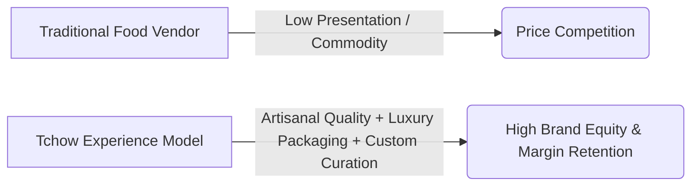
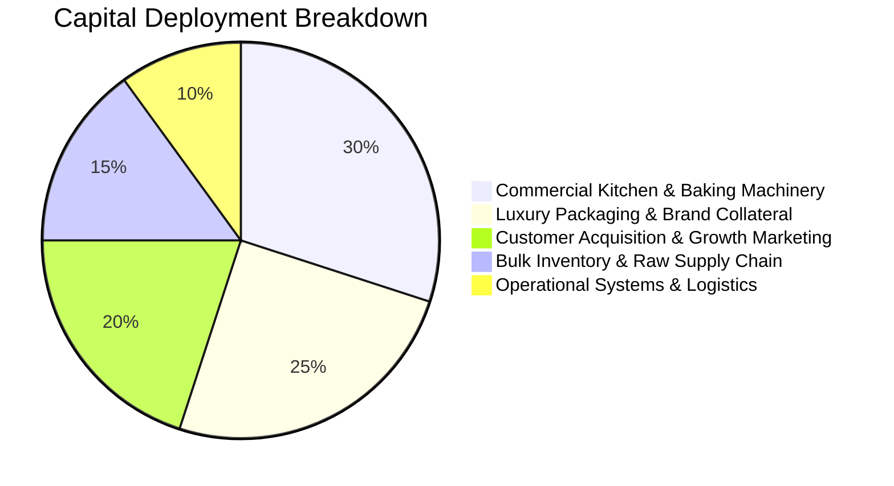
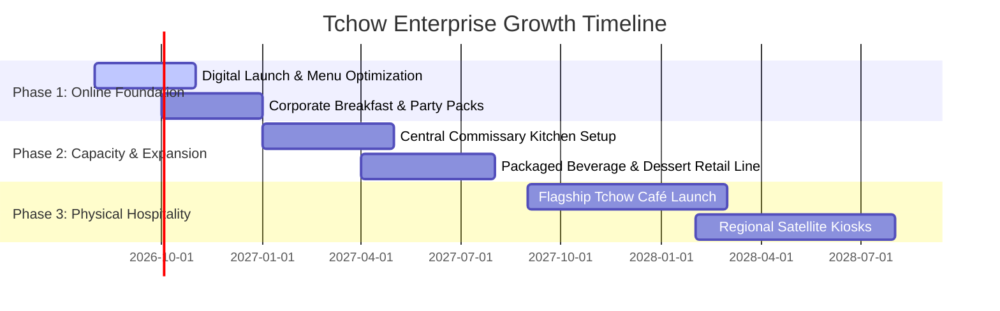

# TCHOW STRATEGIC PARTNERSHIP INVESTMENT PACKAGE
**Building the Future of Memorable Food Experiences**  
*Confidential Investment & Strategic Partnership Memorandum*

---

## 1. Executive Summary

**Tchow** is a modern culinary and beverage brand pioneering an experience-first model in the fast-growing hospitality and lifestyle food segment. 

Unlike traditional food vendors, Tchow is built around **curated dining moments**—uniting gourmet weekend breakfast platters, artisanal Nigerian small chops, layered dessert parfaits, and botanical craft beverages into customizable, beautifully packaged experiences.

### Key Brand Highlights
* **Founder & CEO:** Toyomfonabasi Leo Uttah
* **Business Model:** Online-first digital fulfillment expanding into regional high-efficiency production hubs and flagship **Tchow Café** destinations.
* **Core Product Architecture:** 
  * *Signature Collection* (The Tchow Box, Weekend Bliss Breakfast, Parfait Royale, Sunset Cooler)
  * *High-Volume Party Packs* (20, 40, 80, 150+ piece assortments)
  * *Bespoke 5-Step "Build Your Own Box" Engine*
* **Target Audience:** Modern urban professionals, corporate teams, weekend brunch lovers, event hosts, and premium gifters.

---

## 2. The Opportunity & Market Position

The food and beverage market is shifting rapidly from standard commodity sustenance toward **experience-driven, visually engaging, and highly convenient culinary lifestyle brands**.



### Why Tchow Wins
1. **High Gross Margins:** Small chops, artisan breakfast items, parfaits, and botanical beverages boast gross margins between **60% and 75%**.
2. **Predictable Batch Operations:** Focused launch menu (25–30 high-margin SKUs) minimizes ingredient waste and optimizes kitchen prep time.
3. **Multi-Channel Revenue Streams:** Direct-to-consumer online ordering, corporate breakfast subscriptions, private event catering, and wholesale dessert/beverage supply.

---

## 3. Structured Partnership & Investment Pathways

Tchow provides five structured investment and partnership vehicles designed to match distinct investor risk profiles, capital horizons, and strategic value.

```
+-----------------------------------------------------------------------------------+
|                           TCHOW PARTNERSHIP SUITE                                 |
+---------------------+---------------------+------------------+--------------------+
| 🍰 FIXED RETURN     | 📈 REVENUE SHARE    | 🤝 STRATEGIC     | ⚙️ ASSET &         |
|    INVESTMENT       |    GROWTH MODEL     |    EQUITY        |    EQUIPMENT       |
| • 25% Fixed p.a.    | • 10-15% Gross Share| • Entity Shares  | • Machinery Lease  |
| • 12-Month Horizon  | • High Volume Upside| • Multi-Unit Cap | • Asset Security   |
| • Non-Dilutive      | • Quarterly Payout  | • Governance     | • Monthly Yield    |
+---------------------+---------------------+------------------+--------------------+
```

### Pathway A: Fixed Return Investment (Predictable Capital Growth)
* **Target Investor:** Individuals looking for guaranteed, secure capital appreciation without equity dilution.
* **Minimum Capital:** ₦200,000 – ₦5,000,000
* **Fixed ROI:** **25.0% Annualized**
* **Term:** 12 Months (Principal + Return paid at maturity or quarterly amortized).
* **Security:** Backed by commercial receivables and company inventory covenants.

### Pathway B: Revenue & Growth Share (Volume Velocity Model)
* **Target Investor:** Growth-focused investors seeking upside aligned with monthly top-line sales velocity.
* **Structure:** 10% to 15% of designated quarterly gross culinary sales distributed pro-rata until target yield is achieved (Target yield: ~**32% - 38% p.a.**).
* **Reporting:** Monthly financial statements and verifiable dispatch volume metrics.

### Pathway C: Strategic Equity & Co-Ownership (Long-Term Valuation)
* **Target Investor:** High-net-worth individuals, angel syndicates, and hospitality operators believing in the enterprise valuation and eventual rollout of **Tchow Café** physical branches.
* **Capital Tranche:** ₦5,000,000+
* **Benefits:** Direct equity holding, board advisory seat, priority rights on regional café franchise openings, and long-term capital appreciation.

### Pathway D: Asset & Commercial Kitchen Partner
* **Target Partner:** Equipment suppliers, industrial kitchen fabricators, and commercial real estate holders.
* **Structure:** Provision of high-grade commercial ovens, blast chillers, beverage sealing machines, or delivery logistics vehicles under equipment lease-to-yield frameworks.
* **Benefits:** Direct monthly leasing yield, asset depreciation write-offs, and first-lien collateral security.

### Pathway E: Strategic Growth Advisor & Channel Partner
* **Target Partner:** Corporate procurement managers, event planners, hospitality influencers, and marketing partners providing strategic contracts in exchange for milestone-based retainers or revenue share.

---

## 4. Use of Funds & Capital Deployment

Capital secured across Phase 1 and Phase 2 is allocated with strict fiscal discipline:



| Deployment Area | Allocation | Strategic Objective |
| :--- | :--- | :--- |
| **Kitchen Machinery & Equipment** | **30%** | Industrial ovens, automated dough rollers, blast chillers, and commercial beverage dispensers to increase daily output 5x. |
| **Branding & Custom Packaging** | **25%** | Bespoke luxury insulated delivery boxes, branded parchment sleeves, foil-stamped labels, and unboxing collateral. |
| **Digital Performance Marketing** | **20%** | Targeted social campaigns, influencer tasting boxes, corporate outreach, and localized breakfast subscription promotions. |
| **Supply Chain & Inventory** | **15%** | Direct farm procurement of unbleached flour, butter, organic hibiscus, dairy, and poultry to secure 20% bulk discounts. |
| **Logistics & Dispatch Software** | **10%** | Temperature-controlled delivery bags, dispatch routing software, and automated WhatsApp order confirmation bots. |

---

## 5. Phased Enterprise Roadmap



---

## 6. Risk Mitigation & Governance

| Risk Factor | Probability | Impact | Mitigation Strategy |
| :--- | :--- | :--- | :--- |
| **Food Cost Inflation** | Medium | Medium | Long-term bulk vendor supply agreements; flexible combo pricing; agile recipe engineering. |
| **Delivery Logistics Delays** | Medium | High | Dedicated internal dispatch partners; insulated thermal carriers; scheduled time-window pre-orders. |
| **Quality Inconsistency** | Low | High | Standardized batch recipe cards; automated timer equipment; double-check QA before box sealing. |
| **Capital Security** | Low | High | Transparent escrow accounting; monthly performance reporting; non-dilutive asset covenants. |

---

## 7. Strategic Partner Onboarding (6 Steps)

1. **Step 1 — Prospectus Review:** Evaluate partnership tiers and investment thresholds.
2. **Step 2 — Model Selection:** Choose Fixed ROI, Revenue Share, Strategic Equity, or Asset Partnership.
3. **Step 3 — Application Submission:** Submit investor credentials via digital form or direct desk.
4. **Step 4 — Executive Briefing:** Strategic alignment call with Founder **Toyomfonabasi Leo Uttah**.
5. **Step 5 — Formal Agreement:** Execution of standardized, legally vetted partnership memorandum.
6. **Step 6 — Deployment & Yield:** Capital deployment, monthly updates, and scheduled returns.

---

## 8. Founder's Commitment & Executive Contact

> *"Tchow represents more than a food business. It represents an opportunity to build a modern hospitality institution centered around quality, creativity, and meaningful connections. We invite you to be part of building a food brand designed for today and scaled for the future."*  
> — **Toyomfonabasi Leo Uttah**, Founder & CEO

### Executive Contact Desk
* **Founder Name:** Toyomfonabasi Leo Uttah
* **Direct Email:** `invest@tchow.com` / `hello@tchow.com`
* **Direct WhatsApp / Phone:** `+234 812 345 6789`
* **Headquarters:** Lagos, Nigeria
* **Web Platform:** `http://localhost:5174/` (Interactive Investor Hub Active)
